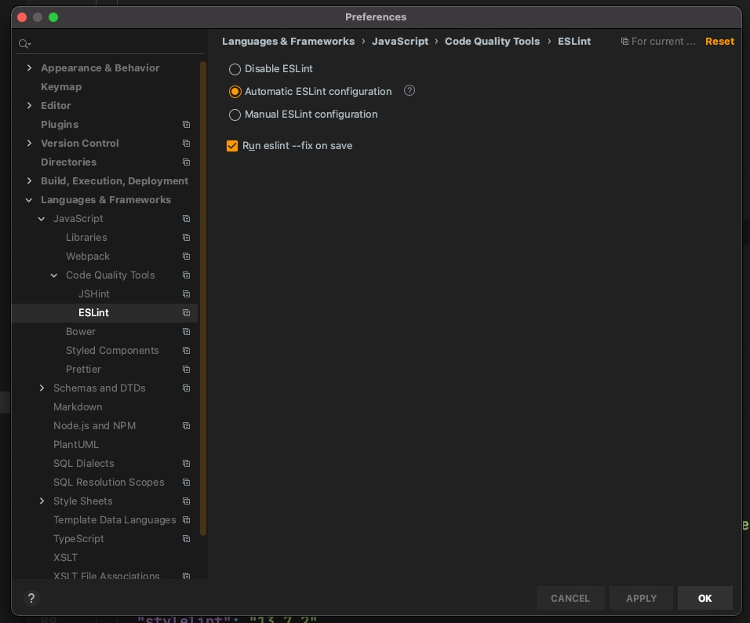
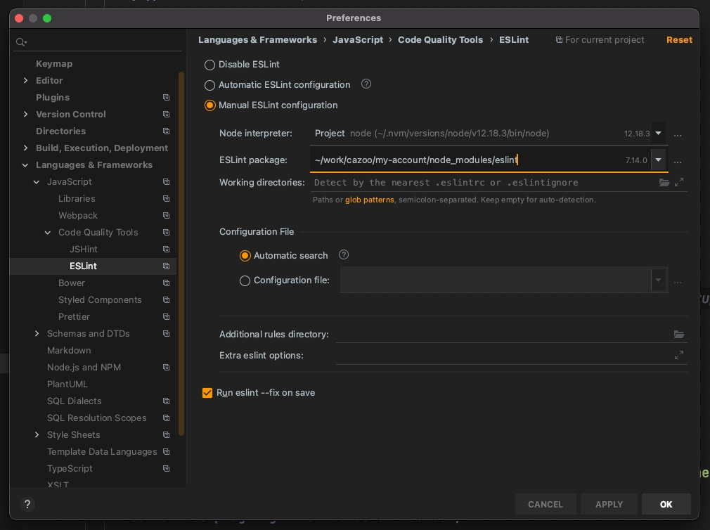

# Cazoo ESLint

## What's this?

It's an NPM package providing an opinionated ESLint configuration to use at Cazoo.
It exposes two ESLint presets:

- `plugin:@cazoo-uk/eslint/react` for React based applications
- `plugin:@cazoo-uk/eslint/node` for Node.js applications

## Why do we want this?

We have quite coherent dev stack at Cazoo (React/TypeScript/Node/Jest), and most projects are set up with ESLint and Prettier.
This package aims at avoiding all the duplication between teams.

This does not aim at being the true and only way.
Teams are more than welcome to extend this in their project and enable/disable rules.
PRs are also welcome if there are some useful rules/plugins that we could add to benefit everyone.

## What does it setup?

- [ESLint recommended rules](https://eslint.org/docs/rules/)
- [TypeScript ESLint plugin recommended rules](https://www.npmjs.com/package/@typescript-eslint/eslint-plugin)
- [Prettier](https://prettier.io/) running as part of ESLint
- [eslint-plugin-simple-import-sort](https://www.npmjs.com/package/eslint-plugin-simple-import-sort) to automatically sort dependencies

When using React ⚛️:

- [eslint-plugin-react](https://www.npmjs.com/package/eslint-plugin-react) for rules regarding React
- [eslint-plugin-react-hooks](https://www.npmjs.com/package/eslint-plugin-react-hooks) for rules regarding React hooks
- [eslint-plugin-jsx-a11y](https://www.npmjs.com/package/eslint-plugin-jsx-a11y) for rules regarding accessibility best practices

It also tells ESLint that `jest` exists in `.test.ts(x)` and `.spec.ts(x)` files. 

## How do I use it?

### Migrating an existing app

If you already ESLint on your project first remove all ESLint plugins dependencies as well as prettier:

```
npm remove eslint @typescript-eslint/eslint-plugin @typescript-eslint/parser eslint-config-prettier eslint-plugin-jsx-a11y eslint-plugin-prettier eslint-plugin-react eslint-plugin-simple-import-sort prettier
```

Then follow the instructions for a new app bellow.

### On a new app

First install `@cazoo-uk/eslint-plugin-eslint` and `eslint` as dev dependencies:

```bash
npm i -D @cazoo-uk/eslint-plugin-eslint eslint@7
```

Then add an `.eslintrc.json` config file to the root of your project containing only:

**For a React ⚛️ app use:**

```json
{
  "extends": [
    "plugin:@cazoo-uk/eslint/react"
  ]
}
```

**For a Node.js app (like an API) use:**

```json
{
  "extends": [
    "plugin:@cazoo-uk/eslint/node"
  ]
}
```

Finally, add a `lint` rule to your `package.json`:

```json
{
  "scripts": {
    "lint": "eslint --fix 'src/**/*.{ts,tsx}'"
  }
}
```

To lint and fix your project you can now run:

```bash
npm run lint
```

## Running ESLint on save

### In WebStorm

Go to `Preferences > Languages and Framework > JavaScript > Code Quality Tools > ESLint`:



- Check `Automatic ESLint configuration`
- Check `Run eslint --fix on save`

You're done 🎉!
Webstorm will now reformat your file with prettier and sort your imports on save, as well as showing you ESLint errors and warnings.

⚠️ If you want to avoid doing this for every new project you can set that setting in: `File > New Project settings > Preferences for New Projects`

⚠️ If Webstorm complains about not finding ESLint it usually means that you have multiple ESLint (monorepo).
Check `Manual ESLint configuration` in the settings instead.
Then click in ESLint package, click on the arrow and select the path to one of your ESLint package (whichever you want).



### In VSCode

First, install the [VSCode ESLint extension](https://marketplace.visualstudio.com/items?itemName=dbaeumer.vscode-eslint).

Once installed, on Mac you'll need to click on `❌ ESLint` at the bottom right of your window to allow the extension access.

Then, go to `Settings > Workspace`, and search for `Code Actions On Save` in the search bar on top.

Then click on: `Edit in settings.json`, and enter:

```json
{
  "editor.codeActionsOnSave": {
    "source.fixAll.eslint": true
  }
}
```

You're good to go 🎉!
VSCode will now reformat your file with prettier and sort your imports on save, as well as showing you ESLint errors and warnings.

## Pre commit hooks

If you wish to enforce running ESLint before commits you can use [Husky 🐶](https://github.com/typicode/husky/tree/master).

First install `husky` as a dev dependency:

```bash
npm i -D husky@4
```

⚠️ Husky 5 licence doesn't allow use in non open-source project.
Please use Husky 4.x!

Then add `Husky` configuration in your `package.json`:

```json
{
  "husky": {
    "hooks": {
      "pre-commit": "lint-staged"
    }
  },
  "lint-staged": {
    "*.{ts,tsx}": [
      "eslint --fix"
    ]
  }
}
```

This will only run ESLint on the files that are about to be committed, so it should be quite fast ⚡️! 
